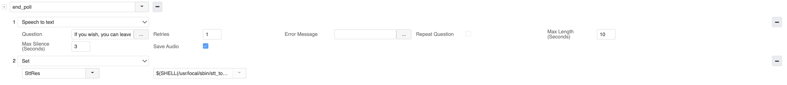

## Usage of the Wildix STT application script example
1. Copy stt_to base.py script to the PBX
2. Add execution rights to the script
3. Need to install library mysql.connector
```
# apt-get update
# apt-get install python3-pip
# pip3 install mysql.connector
```
4. Prepare db (see an example of db connection and structure in stt_to_base.py script)
5. Create dialplan contexts (example of it see on the screenshots)
   
   
   


### Description of example custom application string:
- `/usr/local/sbin/stt_to_base.py` - path to the script file
- `${CALLERID(num)}` - first argument, caller number
- `${RECOGNITION_RESULTS}` - second argument, results of TTS application recognition in json

### Dump of the dialplan example in the developer mode:
```
[
  {
    "number": "+393123456789",
    "apps": [
      {
        "name": "Set",
        "params": {
          "key": "RECOGNITION_LABEL",
          "value": "caller_name"
        }
      },
      {
        "name": "Stt",
        "params": {
          "question": "Prego, dica il suo nome",
          "errorMessage": "",
          "retries": "1",
          "repeatQuestion": "",
          "maxLength": "10",
          "maxSilence": "3",
          "saveAudio": "1"
        }
      },
      {
        "name": "Set",
        "params": {
          "key": "RECOGNITION_LABEL",
          "value": "caller_surname"
        }
      },
      {
        "name": "Stt",
        "params": {
          "question": "Prego, dica il suo cognome",
          "errorMessage": "",
          "retries": "1",
          "repeatQuestion": "",
          "maxLength": "10",
          "maxSilence": "3",
          "saveAudio": "1"
        }
      },
      {
        "name": "Set",
        "params": {
          "key": "RECOGNITION_LABEL",
          "value": "caller_number"
        }
      },
      {
        "name": "Stt",
        "params": {
          "question": "Prego, dica il numero di telefono a cui possiamo ricontattarla",
          "errorMessage": "",
          "retries": "1",
          "repeatQuestion": "",
          "maxLength": "10",
          "maxSilence": "3",
          "saveAudio": "1"
        }
      },
      {
        "name": "Set",
        "params": {
          "key": "RECOGNITION_LABEL",
          "value": "looking_for_other"
        }
      },
      {
        "name": "Stt",
        "params": {
          "question": "Ha bisogno di aiuto per sé o per un’altra persona?",
          "errorMessage": "",
          "retries": "1",
          "repeatQuestion": "",
          "maxLength": "10",
          "maxSilence": "3",
          "saveAudio": "1"
        }
      },
      {
        "name": "GotoIf",
        "params": {
          "condition": "\"${RECOGNITION_RESULT}\"=\"yes\" | \"${RECOGNITION_RESULT}\"=\"si\"",
          "number": "ask_other",
          "dialplan": "main"
        }
      },
      {
        "name": "Goto",
        "params": {
          "number": "end_poll",
          "dialplan": "main"
        }
      }
    ]
  },
  {
    "number": "ask_other",
    "apps": [
      {
        "name": "Set",
        "params": {
          "key": "RECOGNITION_LABEL",
          "value": "other_name"
        }
      },
      {
        "name": "Stt",
        "params": {
          "question": "Prego, dica il nome della persona cercata",
          "errorMessage": "",
          "retries": "1",
          "repeatQuestion": "",
          "maxLength": "10",
          "maxSilence": "3",
          "saveAudio": "1"
        }
      },
      {
        "name": "Set",
        "params": {
          "key": "RECOGNITION_LABEL",
          "value": "other_surname"
        }
      },
      {
        "name": "Stt",
        "params": {
          "question": "Prego, dica il cognome della persona cercata",
          "errorMessage": "",
          "retries": "1",
          "repeatQuestion": "",
          "maxLength": "10",
          "maxSilence": "3",
          "saveAudio": "1"
        }
      },
      {
        "name": "Set",
        "params": {
          "key": "RECOGNITION_LABEL",
          "value": "other_number"
        }
      },
      {
        "name": "Stt",
        "params": {
          "question": "Prego, dica il numero di telefono della persona cercata",
          "errorMessage": "",
          "retries": "1",
          "repeatQuestion": "",
          "maxLength": "10",
          "maxSilence": "3",
          "saveAudio": "1"
        }
      },
      {
        "name": "Set",
        "params": {
          "key": "RECOGNITION_LABEL",
          "value": "other_country"
        }
      },
      {
        "name": "Stt",
        "params": {
          "question": "Prego, dica la nazione di provenienza della persona cercata",
          "errorMessage": "",
          "retries": "1",
          "repeatQuestion": "",
          "maxLength": "10",
          "maxSilence": "3",
          "saveAudio": "1"
        }
      },
      {
        "name": "Stt",
        "params": {
          "question": "Prego, dica la città di provenienza della persona cercata",
          "errorMessage": "",
          "retries": "1",
          "repeatQuestion": "",
          "maxLength": "10",
          "maxSilence": "3",
          "saveAudio": "1"
        }
      },
      {
        "name": "Goto",
        "params": {
          "number": "end_poll",
          "dialplan": "main"
        }
      }
    ]
  },
  {
    "number": "end_poll",
    "apps": [
      {
        "name": "Stt",
        "params": {
          "question": "Se lo desidera, può lasciare un messaggio aggiuntivo",
          "errorMessage": "",
          "retries": "1",
          "repeatQuestion": "",
          "maxLength": "10",
          "maxSilence": "3",
          "saveAudio": "1"
        }
      },
      {
        "name": "Set",
        "params": {
          "key": "SttRes",
          "value": "${SHELL(/usr/local/sbin/stt_to_base.py ${CALLERID(num)} ${BASE64_ENCODE(${RECOGNITION_RESULTS})})})"
        }
      }
    ]
  }
]
```
