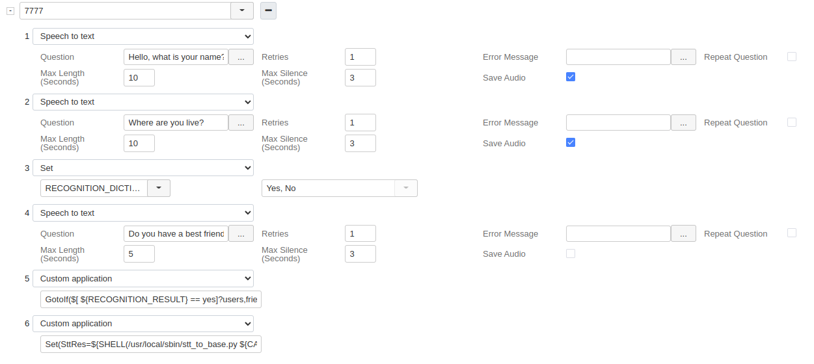
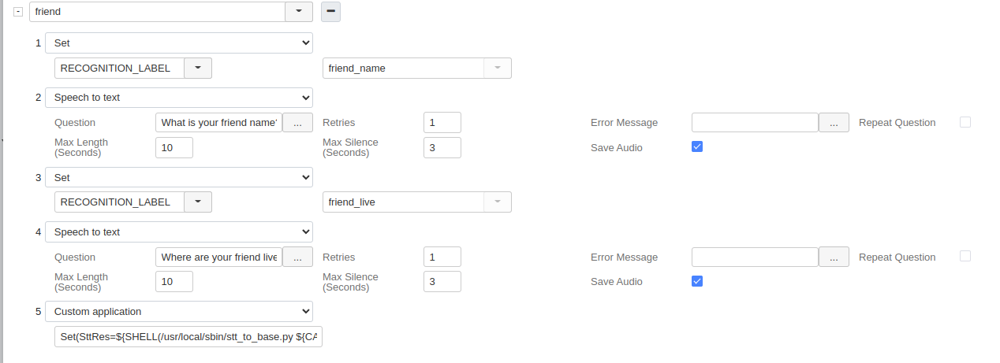

## Usage of the Wildix STT application script example
1. Copy stt_to base.py script to the PBX
2. Add execution rights to the script
3. Run `sqlite3` command and create example table:
```
 CREATE TABLE stt_data (
    id INTEGER PRIMARY KEY AUTOINCREMENT,
    caller_id TEXT,
    user_name TEXT,
    user_place TEXT,
    have_friend INTEGER,
    friend_name TEXT,
    friend_place TEXT,
    audio_file TEXT,
    error INTEGER
);
```
4. Verify that sqlite database file has read and write permission for user wms
5. Create dialplan user's contexts (example of it see on the screenshots)



### Description of example custom application string:
- `/usr/local/sbin/stt_to_base.py` - path to the script file
- `${CALLERID(num)}` - first argument, caller number
- `${RECOGNITION_RESULTS}` - second argument, results of TTS application recognition in json

###Dump of the dialplan example in the developer mode:
```
{
    "number": "7777",
    "apps": [
      {
        "name": "Stt",
        "params": {
          "question": "Hello, what is your name?",
          "errorMessage": "",
          "retries": "1",
          "repeatQuestion": "",
          "maxLength": "10",
          "maxSilence": "3",
          "saveAudio": "1"
        }
      },
      {
        "name": "Stt",
        "params": {
          "question": "Where are you live?",
          "errorMessage": "",
          "retries": "1",
          "repeatQuestion": "",
          "maxLength": "10",
          "maxSilence": "3",
          "saveAudio": "1"
        }
      },
      {
        "name": "Set",
        "params": {
          "key": "RECOGNITION_DICTIONARY",
          "value": "Yes, No"
        }
      },
      {
        "name": "Stt",
        "params": {
          "question": "Do you have a best friend?",
          "errorMessage": "",
          "retries": "1",
          "repeatQuestion": "",
          "maxLength": "5",
          "maxSilence": "3",
          "saveAudio": ""
        }
      },
      {
        "name": "CustomApp",
        "params": {
          "cwApp": "GotoIf($[ ${RECOGNITION_RESULT} == yes]?users,friend,1)"
        }
      },
      {
        "name": "CustomApp",
        "params": {
          "cwApp": "Set(SttRes=${SHELL(/usr/local/sbin/stt_to_base.py ${CALLERID(num)} ${BASE64_ENCODE(${RECOGNITION_RESULTS})})})"
        }
      }
    ]
  },
  {
    "number": "friend",
    "apps": [
      {
        "name": "Set",
        "params": {
          "key": "RECOGNITION_LABEL",
          "value": "friend_name"
        }
      },
      {
        "name": "Stt",
        "params": {
          "question": "What is your friend name?",
          "errorMessage": "",
          "retries": "1",
          "repeatQuestion": "",
          "maxLength": "10",
          "maxSilence": "3",
          "saveAudio": "1"
        }
      },
      {
        "name": "Set",
        "params": {
          "key": "RECOGNITION_LABEL",
          "value": "friend_live"
        }
      },
      {
        "name": "Stt",
        "params": {
          "question": "Where are your friend live?",
          "errorMessage": "",
          "retries": "1",
          "repeatQuestion": "",
          "maxLength": "10",
          "maxSilence": "3",
          "saveAudio": "1"
        }
      },
      {
        "name": "CustomApp",
        "params": {
          "cwApp": "Set(SttRes=${SHELL(/usr/local/sbin/stt_to_base.py ${CALLERID(num)} ${BASE64_ENCODE(${RECOGNITION_RESULTS})})})"
        }
      }
    ]
  }
```
